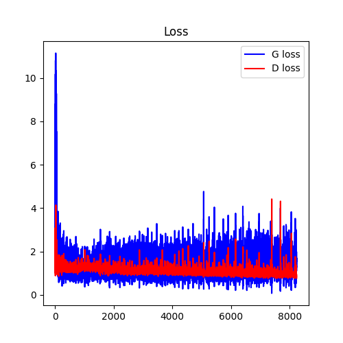

# DCGAN-implementation


## Dataset
You can download dataset img align celeba.zip which was collected from the origin website [CelebFaces](http://mmlab.ie.cuhk.edu.hk/projects/CelebA.html)

## Requirements
The root folder should be structured as follows:
```
  root/
  ├─ img_align_celeba/  # you should download the dataset on the website and set the same name here.
  |  ├─ 000001.jpg
  |  ├─ 000002.jpg
  |  ├─ ...
  |  └─
  
  ├─ result/     # create after running main.py
  |
  └─ main.py
```

### Dependencies
```
matplotlib==3.5.1
numpy==1.22.1
Pillow==9.0.1
torch==1.10.1
torchvision==0.11.3
```

### Preprocess
|   |   |
|:--:|:--:|
|||

Data先經過Resize後，短的那一邊被Resize成指定大小(在本題指定為64pixels),再用CenterCrop切出64×64的影像，在將影像轉換成Tensor之前，將RGB三個通道各別做Normalize到[-1, 1]之間，平均值為0.5。


### learning curve 
- hyper-parameter:
    - learning rate = 0.0002
    - dimension of z domain(nz) = 100
    - number of feature maps in D & G = 64
    - LeakyReLU(0.2): if x<0, then return 0.2 instead of 0(ReLU).
    - Decaying noise: Refer to the exponential decay in 1(c).
    - Label smoothing in both G & D (refer to the range of the value in 1(c))
    
|   | Generated Image | Loss |  |
|:--:|:--:|:--:|:--:|
|||||

### Some Tips
- Add Decaying noise to training data for G and D

| Real Image w/Decaying Noise | Generated Image | Decaying Noise |
|:--:|:--:|:--:|
||||

- Add noise scale A

| Generated Image w/noise scale A =0.5|Loss w/ A=0.5|Generated Image w/noise scale A=1|Loss w/ A=1|
|:--:|:--:|:--:|:--:|
|||||

- Label smoothing in G & D (Use Soft and Noisy Labels)  

| (Real, Fake) = (1, 0) | (Real, Fake) = (0.95, 0.15) | (Real, Fake) = ([0.8, 1.1], [0, 0.3]) |
|:--:|:--:|:--:|
||||


### Some concepts
.png)
- Meaning
    - black dashed line: It is a distribution baed on the real image dataset.
    - x: Domain of real data.
    - z: Domain of sampled noise which will be fed in to the generator.In this case, z is sampled uniformly, but the generator will perform better if z is sampled normally.
- Steps and corresponding objective function
    - Steps(b): D is trained to discriminate between samples from data and from the z domain.
    - Steps(c): G is trained by the guidance from gradient of D , calculated in steps(b).
- The reason why $D(x)$ equals to 0.5 in ideal case when the training is finished
    - It means the discriminator can just guess whether the input image is real or fake, and the generator can successfully fool the discriminator at this time.

### My understaing of Helvetica Scenario
- Occurance: Placing too much probability mass on a single $x$ is indeed a major problem with GANs. It occurs if we don't train D enough (= we train G too much), then G will quickly "run off" and exploit local minima in D.
- How to avoid it: Do not train G too much without updating the parameters of D, both of them must be equally well with each orher.

### Compare two results and describe the pros and cons of two models.
|  |Pros|Cons|
|:--:|:--:|:--:|
|VAE| There is a clear and recognized way to evaluate the quality of the model (log-likelihood, either estimated by importance sampling or lower-bounded). | VAE can only generate the images that is similar to images in the training dataset, because VAE models explicitly learn likelihood distribution through loss function. Variational methods introduce deterministic bias because they optimize a lower bound on the log-likelihood. |
|GAN| The images are more creative and real-looking. Cause GAN learns through the so-called “min-max two-player game" to learn likelihood distribution.| Requires finding a Nash equilibrium of a game. It’s hard to do things like guess the value of one pixel given another pixel. |


